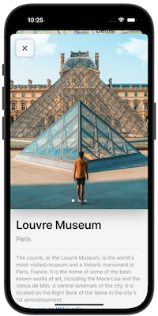
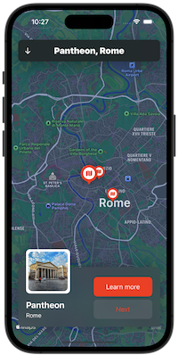
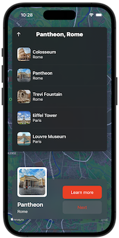
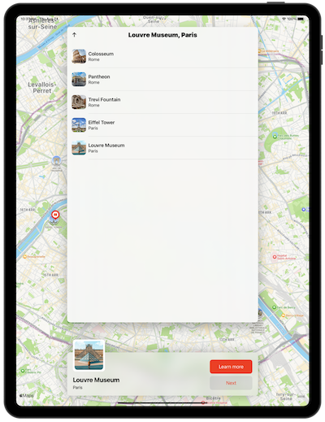
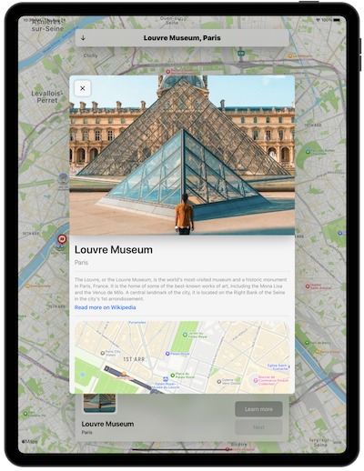

# MapDestination App

<h1>
 
MapDestination
</h1>

# About App

MapDestination is an application for iOS and iPadOS that displays several destination locations along with descriptions and details of these locations. This project was created based on a tutorial from the [Swiftul Thinking](https://www.youtube.com/@SwiftfulThinking/featured) YouTube channel using SwiftUI Framework.

# Features

This following features of the app was made using Swift, SwiftUI, and MapKit with MVVM :

- Show Map using MapKit
- Map Annotation for All Locations
- Select location from the List
- Select location using the Annotation
- Next location with the next button
- Animation while slide to other location
- Detail Location
- Direct to Wikipedia

# Screenshots

## iPhone

#### _Light Mode_

#### _Dark Mode_

## iPad

#### _Light Mode_

#### _Dark Mode_

# Video

## iPhone

<video width="180" controls>
<source src="video/iPhone_Video.mp4" type="video/mp4">
</video>

## iPad

<video width="360" controls>
    <source src="video/iPad_Video.mp4" type="video/mp4">
</video>

# Tech Stack

## Instalation:

- clone this repo, `https://github.com/fauzandwip/MapDestination.git`
- double click file `MapDestination.xcodeproj`
- choose iPhone or iPad simulator, you can choose real device too
- run the app
